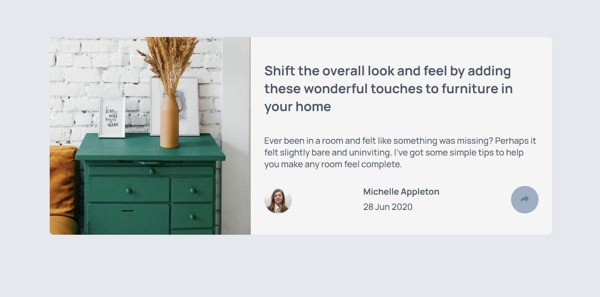

# Frontend Mentor - Article preview component solution

This is a solution to the [Article preview component challenge on Frontend Mentor](https://www.frontendmentor.io/challenges/article-preview-component-dYBN_pYFT). Frontend Mentor challenges help you improve your coding skills by building realistic projects. 

## Table of contents

- [Overview](#overview)
  - [The challenge](#the-challenge)
  - [Screenshot](#screenshot)
- [My process](#my-process)
  - [Built with](#built-with)
  - [What I learned](#what-i-learned)
  - [Useful resources](#useful-resources)
- [Author](#author)

## Overview

### The challenge

Users should be able to:

- View the optimal layout for the component depending on their device's screen size
- See the social media share links when they click the share icon

### Screenshot

## My process

### Built with

- Semantic HTML5 markup
- CSS custom properties
- Flexbox
- Mobile-first workflow
- Javascript
- Google Font
- 

**Note: These are just examples. Delete this note and replace the list above with your own choices**

### What I learned

I learned that I need to take care of my CSS selectors because I went wrong a couple of time!

### Useful resources

- MDN : https://developer.mozilla.org/fr/
- W3School : https://www.w3schools.com/howto/default.asp The "How to" section helped me to get an example on image's cards sizes.

## Author

- Frontend Mentor - https://www.frontendmentor.io/profile/C2dricLeroy
- Twitter - https://twitter.com/Cdric2Leroy
- Linkedin - https://www.linkedin.com/in/cdric2leroy/

